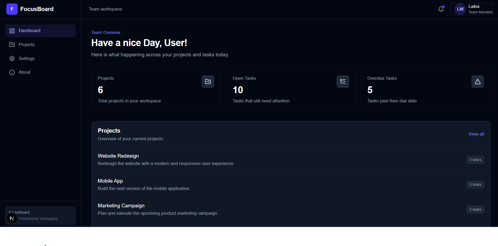

# FocusBoard — Team Project & Task Dashboard

A small team dashboard built for the ProAdvisorCoach Frontend Engineering Internship assignment. Users can browse projects, filter and sort work, create/edit tasks with validation, inspect task details in a modal or a full page, and set a couple of persisted display preferences.

## Screenshots

| Dashboard | Projects — Mobile |
|---|---|
|  |  |

| Task Modal | Form Validation |
|---|---|
|  |  |

## Setup

```bash
npm install
npm run dev
```

Open [http://localhost:3000](http://localhost:3000) — it redirects straight to `/dashboard`.

### Running tests

```bash
npx vitest run
```

Tests live alongside the components they cover, under `src/components/tasks/*.test.jsx`.

## Tech stack & why

| Concern | Choice | Why |
|---|---|---|
| Framework | Next.js (App Router) | Required by the brief; used for nested routing, Route Handlers, and parallel/intercepting routes. |
| Styling | Tailwind CSS | Fast to iterate with, keeps styling co-located with markup, no separate CSS files to maintain. |
| Server state | TanStack Query | One tool for loading/error/refetch/cache-invalidation instead of hand-rolling `useEffect` fetch logic everywhere. |
| Client state | Zustand + `persist` middleware | The only genuinely shared client state in this app is display preference (theme, dashboard view mode) — Zustand is minimal for that and avoids reaching for Context where nothing is actually being shared across a deep tree. |
| Forms | React Hook Form + Zod | Uncontrolled-by-default form performance, paired with schema validation (`lib/validations/taskSchema.js`) instead of hand-written `if` checks. |
| Mock backend | Next.js Route Handlers + a JSON file on disk | Per the assignment's scope rule (no real backend required). `src/data/tasks.json` is read/written with `fs/promises` so create/edit/delete genuinely persist between requests in local dev. |

## Architecture

```
src/
  app/
    (app)/                Route group sharing one layout (AppShell: sidebar + header)
      dashboard/ projects/ tasks/ settings/ about/
    @modal/               Parallel route slot for the task-detail modal
    api/                  Route Handlers (mock REST API)
  components/
    dashboard/ projects/ tasks/ settings/ layout/ providers/
  hooks/                  useTasks, useProjects, useProjectDetail, useDebounce
  lib/
    api/                  fetch wrappers, one per resource (tasks, projects)
    validations/          Zod schemas
  stores/                 Zustand preferences store
  data/                   Seed data (projects.js, tasks.js/tasks.json)
```

Every route under `app/(app)/` shares a single `app/(app)/layout.js`, which renders the sidebar and header once via `AppShell`. Individual pages return only their own content — navigating between dashboard/projects/settings/tasks/about re-renders just that content, not the shell around it.

API access is kept out of components: every component calls a hook (`useTasks`, `useProjects`, …), every hook calls a function in `lib/api/*`, and only those functions touch `fetch`. Components never construct a URL or parse a response themselves.

## Routing & rendering strategy

| Route | Rendering | Notes |
|---|---|---|
| `/` | Server Component | Immediately `redirect()`s to `/dashboard`. |
| `/dashboard` | Server Component → Client Component | Page.js is a Server Component that imports the seed data directly and passes it as props into `DashboardClient`, which then manages it through TanStack Query (server-fetched initial data, client-side interactivity after). |
| `/projects` | Server + Client | Search, status filter, sort, and a cards/list view toggle — all client state, debounced search via a custom hook. |
| `/projects/[projectId]` | Dynamic route, Server Component | `params` is awaited server-side; task list and counts for that project render client-side underneath. |
| `/projects/[projectId]/tasks/new` | Dynamic route | Task creation form (React Hook Form + Zod), shared `TaskForm` component. |
| `/tasks/[taskId]` | Dynamic route with **intercepting route** | Direct navigation/refresh renders the full page (`app/(app)/tasks/[taskId]/page.js`). Navigating to it from within the app instead renders `TaskModal` on top of the current page via `app/@modal/(.)tasks/[taskId]/page.js` — the parallel/intercepting route pattern required by the brief. |
| `/tasks/[taskId]/edit` | Dynamic route | Edit form, same shared `TaskForm` + Zod schema as create. |
| `/settings` | Client-rendered | Theme and dashboard view-mode preference, stored via Zustand's `persist` middleware (localStorage), so it survives a refresh. |
| `/about` | Static, no dynamic data | No per-request data fetching, closest thing in this app to a static/SSG-style page. |

Loading and error states are handled with `loading.js`/`error.js` per route segment (`projects`, `projects/[projectId]`, `tasks/[taskId]/edit`, etc.), plus a `not-found.js` for an unmatched project id. The `/api/projects` Route Handler adds an artificial delay so those loading states are actually visible in dev rather than resolving instantly.

## State & data flow

- **Server state** (projects, tasks): TanStack Query. Mutations (`useCreateTask`, `useUpdateTask`, `useDeleteTask`) invalidate the relevant query keys on success so lists and detail views stay in sync without a manual refetch call scattered through the UI.
- **Client/UI state** (theme, dashboard density/view mode): Zustand, chosen specifically because it's the *only* state here that's genuinely shared across unrelated parts of the tree (sidebar, settings screen, project cards) — everything else stays local `useState` inside the component that owns it.
- **Forms**: React Hook Form manages field state and dirty/touched tracking; Zod (`taskSchema.js`) defines the single source of truth for what a valid task looks like, used identically by both the create and edit forms.

## Two optimization-related decisions

1. **`useDebounce` on the project search input** — without it, every keystroke would immediately re-filter the (client-side) project list. The debounce isn't wrapping a network call, but it still avoids re-running the filter/sort computation on every single keystroke.
2. **TanStack Query's cache over manual `useState` + `useEffect` fetching** — mutations invalidate query keys instead of the UI holding its own copy of server data that would drift out of sync after an edit. This removes an entire category of "forgot to refetch after mutating" bugs rather than optimizing around them.

## Requirement checklist

| Requirement | Status |
|---|---|
| Dashboard summary cards, recent activity, project list | ✅ |
| Projects: search, filter, sort, responsive cards | ✅ |
| Project detail: info, task list, counts, add-task action | ✅ |
| Task create/edit: validated form (title, description, status, priority, assignee, due date) | ✅ |
| Task detail via intercepting-route modal, direct URL still works | ✅ |
| Settings screen, persisted locally | ✅ (theme + dashboard view mode via Zustand `persist`) |
| App Router, nested layouts, dynamic routes | ✅ All authenticated routes share one `app/(app)/layout.js`; dynamic routes and the modal parallel route are in place. |
| ≥3 rendering approaches | ✅ Server Component + seed data (dashboard), client interactivity (all list/detail views), static page (about) |
| Loading UI / error boundaries | ✅ `loading.js` + `error.js` per route segment |
| Parallel/intercepting route for task detail | ✅ |
| Page metadata on main routes | ✅ |
| TanStack Query: loading/error/refetch/cache | ✅ |
| One global state library, used only where justified | ✅ Zustand, scoped to preferences only |
| React Hook Form + Zod validation | ✅ |
| Graceful API failure handling with feedback | ✅ `sonner` toasts + inline alert states |
| API/service separation from UI | ✅ `lib/api/*` |
| Responsive, no horizontal overflow on mobile | ✅ |
| Semantic HTML, labeled inputs, keyboard-accessible dialog, focus states | ✅ modal uses `role="dialog"`/`aria-modal`, focus is moved to the close button on open |
| Light/dark theme, persists on refresh |  Persists correctly via Zustand
| TypeScript | ❌ Project is JavaScript/JSX throughout, not TypeScript |
| ≥4 automated tests (interaction, validation, loading/error, data flow) | ✅ `TaskModal.test.jsx` (interaction), `TaskForm.test.jsx` (validation), `TaskDetailClient.test.jsx` (error state), `TaskDetailClient.data.test.jsx` (data flow) |
| Passes lint, no console noise in normal use | ✅ |

